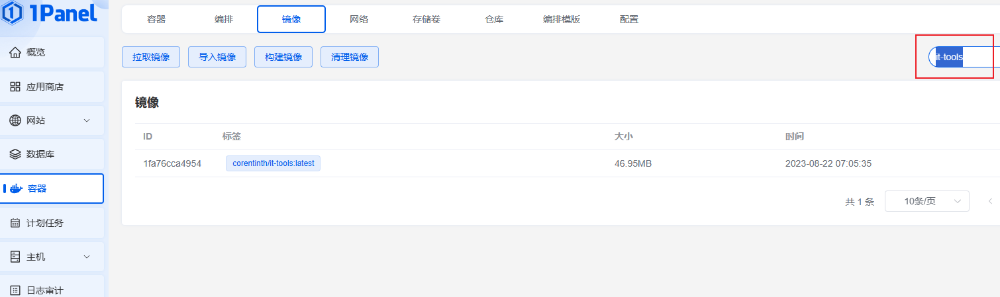
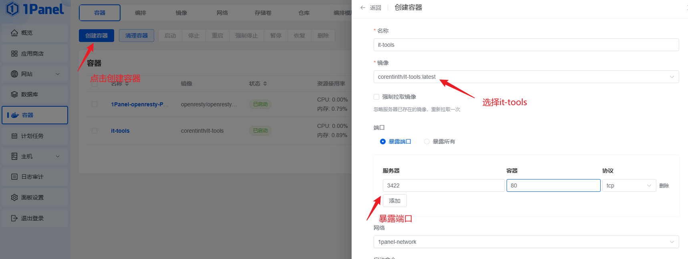
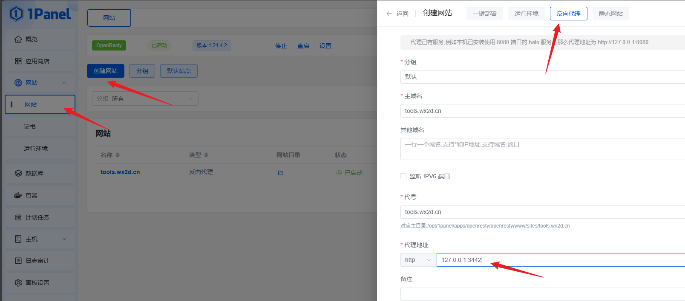

这里教大家如何部署属于自己的it工具站，[演示地址](https://tools.wx2d.cn)

## 安装1Panel

什么是1Panel？1Panel 是一个现代化、开源的 Linux 服务器运维管理面板。说白了，宝塔知道吧？功能类似，但这个更好用。

傻瓜式一键安装，我服务器是ubuntu，所以命令如下，其他配置参考[安装文档](https://1panel.cn/docs/installation/online_installation/)

```sh
curl -sSL https://resource.fit2cloud.com/1panel/package/quick_start.sh -o quick_start.sh && sudo bash quick_start.sh
```

## 部署it-tools

这里使用的是开源的工具站[it-tools](https://github.com/CorentinTh/it-tools)，同样，傻瓜式docker安装

### 搜索镜像



### 创建容器



### 反向代理

如果网站这里没有，需要先安装OpenResty，开源去应用商店点安装



### 测试访问

[点击访问](https://tools.wx2d.cn)

## 错误排查

1、域名是否解析到了服务器ip
2、安全组的端口是否放行，通常报错是502