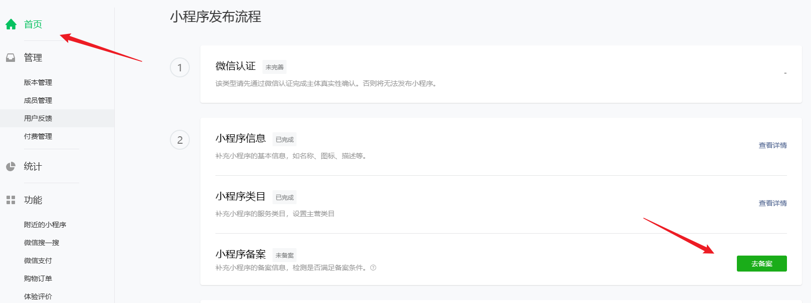
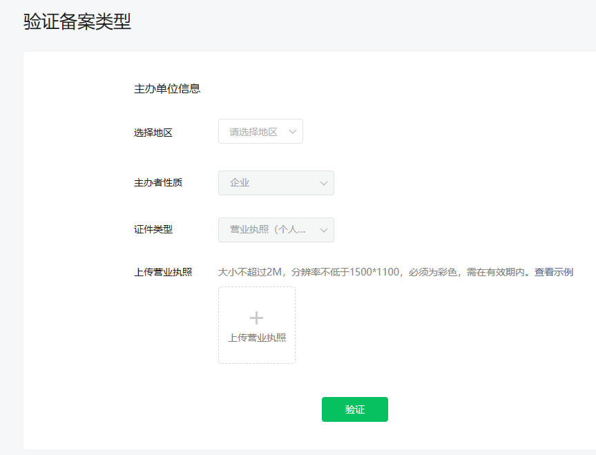
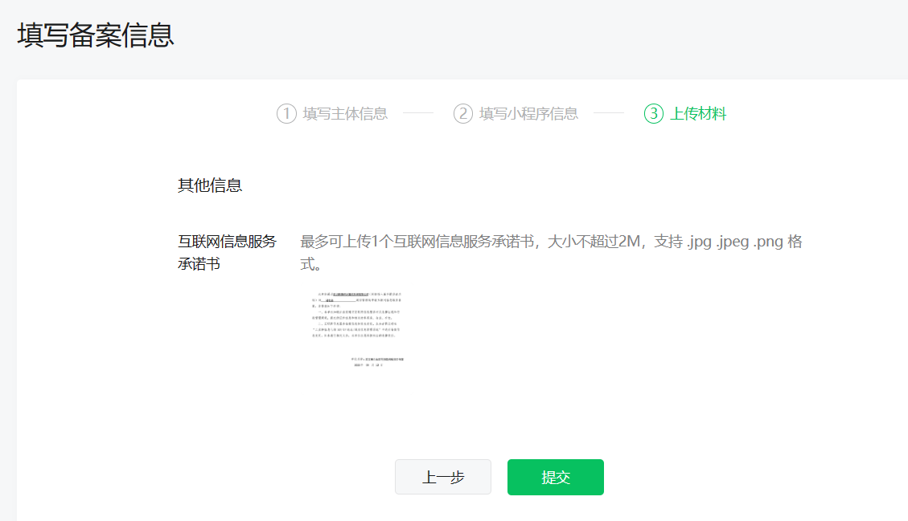
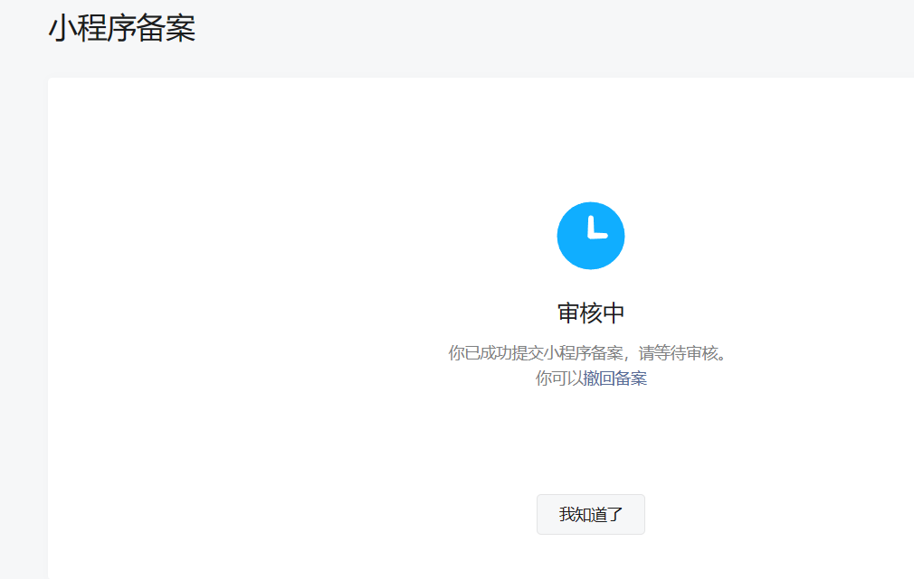

1、《中华人民共和国反电信网络诈骗法》 第二十三条 设立移动互联网应用程序应当按照国家有关规定向电信主管部门办理许可或者备案手续。

2、《互联网信息服务管理办法》 第四条 国家对经营性互联网信息服务实行许可制度；对非经营性互联网信息服务实行备案制度。未取得许可或者未履行备案手续的，不得从事互联网信息服务。
第五条 从事新闻、出版、教育、医疗保健、药品和医疗器械等互联网信息服务，依照法律、行政法规以及国家有关规定须经有关主管部门审核同意的，在申请经营许可或者履行备案手续前，应当依法经有关主管部门审核同意。

3、《非经营性互联网信息服务备案管理办法》 第五条 在中华人民共和国境内提供非经营性互联网信息服务，应当依法履行备案手续。未经备案，不得在中华人民共和国境内从事非经营性互联网信息服务。
第十一条 拟从事新闻、出版、教育、医疗保健、药品和医疗器械、文化、广播电影电视节目等互联网信息服务，根据法律、行政法规以及国家有关规定应经有关主管部门审核同意的，在履行备案手续时，还应向其住所所在地省通信管理局提交相关主管部门审核同意的文件。
第十三条 非经营性互联网信息服务提供者应当在其网站开通时在主页底部的中央位置标明其备案编号，并在备案编号下方按要求链接信息产业部备案管理系统网址，供公众查询核对。
非经营性互联网信息服务提供者应当在其网站开通时，按照信息产业部备案管理系统的要求，将备案电子验证标识放置在其网站的指定目录下。

## 登录小程序

[登录地址](https://mp.weixin.qq.com/)

## 备案入口

截至到23年9月14日，存量小程序暂未开放备案，新增小程序需备案

按要求填写信息

填写完毕等待审核

