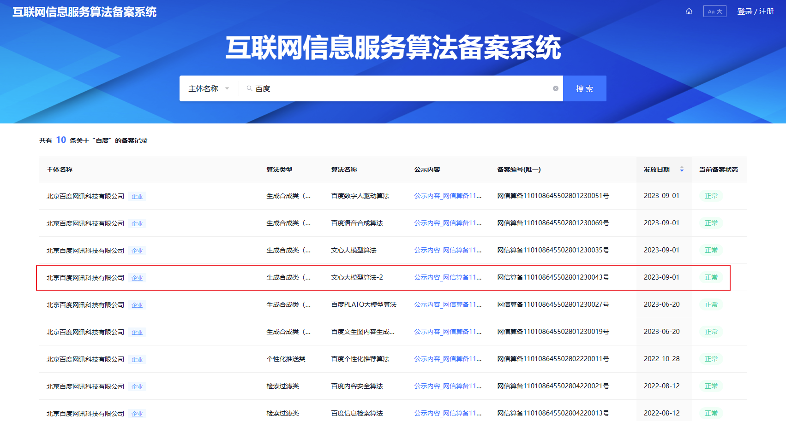
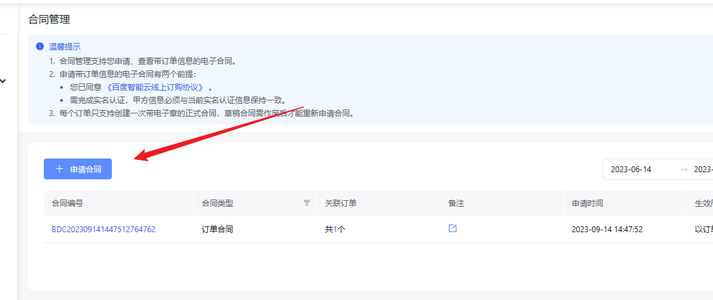
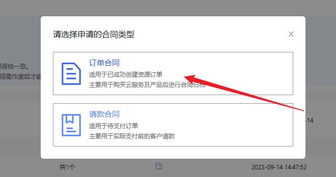
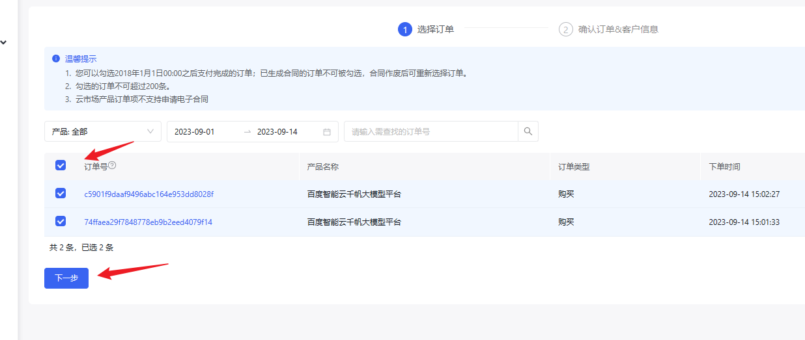
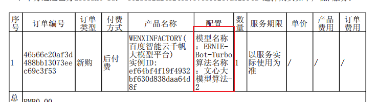

各大应用商店和微信小程序平台对于应用了「应用含深度合成或生成式人工智能服务」的应用都有这比较严格的资质要求，其中最核心的2点要求如下：
1. 技术主体的《互联网信息服务算法备案》（算法类型为“生成合成类（深度合成）”）或《互联网信息服务算法备案》（算法类型为“生成合成类”）在审批中的系统截图
2. 应用/小程序主体与技术主体的合作协议（协议需含【算法名称】或【应用产品】或【备案编号】相关内容)

第一点很好办，百度的文心大模型在互联网信息服务算法备案系统中的备案截图。文心大模型算法已经与2023年9月1日通过了算法备案，在系统中也可以查到：
1. 进入互联网信息服务算法备案系统：[备案系统](https://beian.cac.gov.cn/#/searchResult)
2. 搜索技术主体「百度」
3. 找到「文心大模型算法-2」的备案记录并截图

第二点就有点难度，联系百度让其出具一份写了算法名称的合作协议？具体应该找谁？协议应该怎么写？不用考虑这些，直接在百度智能云控制台下载电子合同就可以了。为了让开发者尽快完成应用上架，降低大家的操作成本，百度智能云售后技术支持团队与千帆产研团队紧锣密鼓的给大家趟平了路，根据审核规则，在电子合同内补齐了算法名称信息。获取步骤如下：
1. 登录百度智能云控制台，进入合同管理页面：[合同管理页面](https://console.bce.baidu.com/billing/contract/list)
2. 点击生成合同，选择订单合同

 

3. 勾选当时开通ERNIE-Bot或者ERNIE-Bot-turbo推理服务的订单（只有百度自研的文心大模型的产品配置才会展示算法名称），点击下一步

 

4. 按实际情况，填写地址、联系人、电话，点击生成草稿合同

5. 刷新页面，点击生成的草稿合同，可以看到配置列展示了模型名称和算法名称

6. 点击转成正式合同，刷新页面，最后下载正式合同即可

 

7. 下载的正式合同中有百度智能云的电子公章，可以作为合作协议上传至应用商店/微信小程序平台

最后祝愿大家的应用能早日顺利上架，基于文心大模型，千帆大模型平台开发出属于自己的AI原生应用！