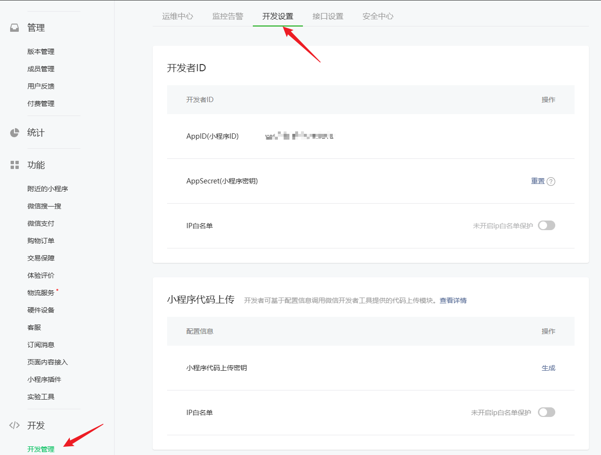
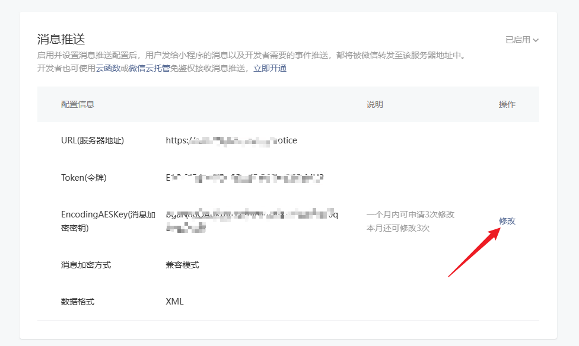
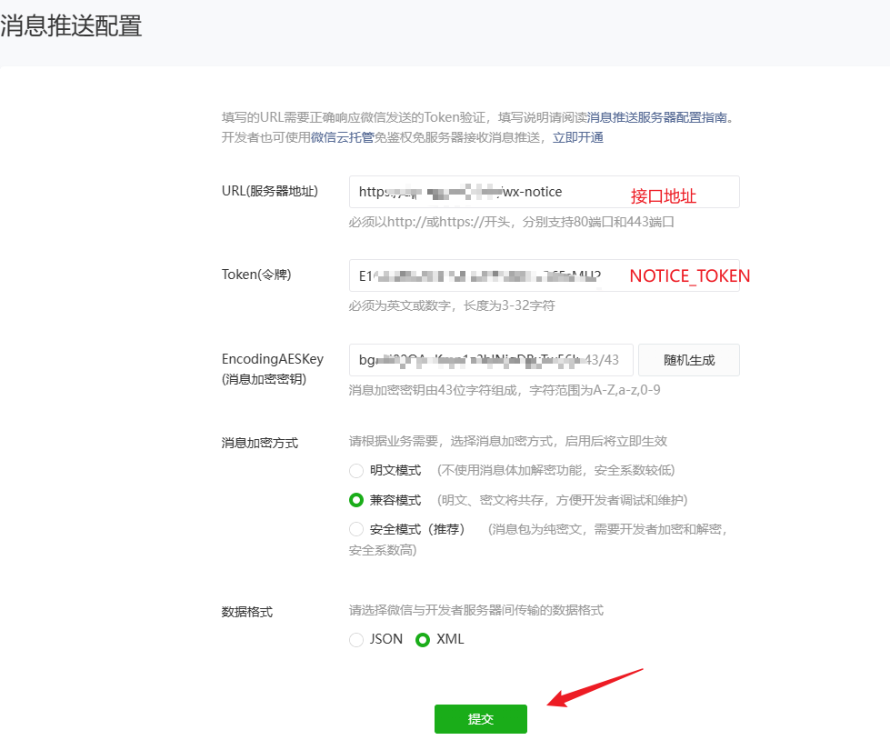
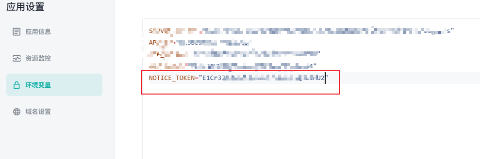

## 官方文档

[消息推送](https://developers.weixin.qq.com/miniprogram/dev/framework/server-ability/message-push.html)

## Laf代码

创建函数，函数名为 `wx-notice`

```js
import * as crypto from 'crypto';
import cloud from '@lafjs/cloud'
const NOTICE_TOKEN = process.env.NOTICE_TOKEN
const db = cloud.database()

// 处理接收到的小程序消息
export async function main(ctx: FunctionContext) {
  console.log("wx-notice-query", ctx.query)
  console.log("wx-notice-body", ctx.body)
  const { signature, timestamp, nonce, echostr } = ctx.query;
  console.log(signature, timestamp, nonce, echostr)

  // 验证消息是否合法，若不合法则返回错误信息
  if (!verifySignature(signature, timestamp, nonce)) {
    console.log('Invalid signature')
    return 'Invalid signature';
  }

  // 如果是首次验证，则返回 echostr 给微信服务器
  if (echostr) {
    return echostr;
  }

  // 处理接收到的消息
  const payload = ctx.body.xml;
  console.log("receive message:", payload)
  if (payload.event[0] === 'wxa_media_check') {
    if (payload.result[0].suggest[0] !== 'pass') {
       await db.collection('img-check').where({ trace_id: payload.trace_id[0] }).getOne()
    }
  }
  // 其他情况直接回复 'success' 或者 '' 避免出现超时问题

  return 'success'
}


// 校验微信服务器发送的消息是否合法
function verifySignature(signature: string, timestamp: string, nonce: string) {
  const arr = [NOTICE_TOKEN, timestamp, nonce].sort();
  const str = arr.join('');
  const sha1 = crypto.createHash('sha1');
  sha1.update(str);
  return sha1.digest('hex') === signature;
}

```


## 代码解释

1. `NOTICE_TOKEN` 环境变量取值，首先登录小程序后台[登录地址](https://mp.weixin.qq.com/)
   
   
   
   

   

   
  
 
 
