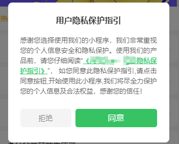
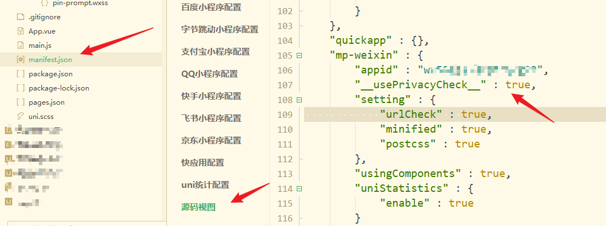
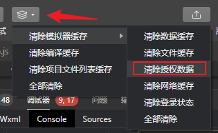

为规范开发者的用户个人信息处理行为，保障用户的合法权益，自2023年9月15日起，对于涉及处理用户个人信息的小程序开发者，微信要求，仅当开发者主动向平台同步用户已阅读并同意了小程序的隐私保护指引等信息处理规则后，方可调用微信提供的隐私接口。

## 官方文档

[用户隐私保护](https://developers.weixin.qq.com/miniprogram/dev/framework/user-privacy/PrivacyAuthorize.html)

## 效果展示

[原插件地址](https://ext.dcloud.net.cn/plugin?id=14445)




## uniapp的操作指引

### 1、修改文件`mainfest` 

新增参数 `"__usePrivacyCheck__" : true,` 如图




### 2、新建组件
新建目录文件为 `components/privacy-popup/privacy-popup.vue`

```js
<template>
	<view v-if="showPrivacy" :class="privacyClass">
		<view :class="contentClass">
			<view class="title">用户隐私保护指引</view>
			<view class="des">
				感谢您选择使用我们的小程序，我们非常重视您的个人信息安全和隐私保护。使用我们的产品前，请您仔细阅读“
				<text class="link" @tap="openPrivacyContract">{{privacyContractName}} </text>”，
				如您同意此隐私保护指引,请点击同意按钮,开始使用此小程序,我们将尽全力保护您的个人信息及合法权益，感谢您的信任！<br />
			</view>
			<view class="btns">
				<button class="item reject" @tap="exitMiniProgram">拒绝</button>
				<button id="agree-btn" class="item agree" open-type="agreePrivacyAuthorization"
					@agreeprivacyauthorization="handleAgreePrivacyAuthorization">同意</button>
			</view>
		</view>
	</view>
</template>

<script>
	export default {
		name: 'PrivacyPopup',
		data() {
			return {
				isRead: false,
				showPrivacy: false,
				privacyContractName: '',
				resolvePrivacyAuthorization: null,
			};
		},
		props: {
			position: {
				type: String,
				default: 'center'
			}
		},
		computed: {
			privacyClass() {
				return this.position === 'bottom' ? 'privacy privacy-bottom' : 'privacy';
			},
			contentClass() {
				return this.position === 'bottom' ? 'content content-bottom' : 'content';
			}
		},
		mounted() {
			if (wx.onNeedPrivacyAuthorization) {
				wx.onNeedPrivacyAuthorization((resolve) => {
					this.resolvePrivacyAuthorization = resolve;
				});
			}

			if (wx.getPrivacySetting) {
				wx.getPrivacySetting({
					success: (res) => {
						console.log(res, 'getPrivacySetting');
						if (res.needAuthorization) {
							this.privacyContractName = res.privacyContractName;
							this.showPrivacy = true;
						}
					},
				});
			}
		},

		methods: {
			openPrivacyContract() {
				wx.openPrivacyContract({
					success: () => {
						this.isRead = true;
					},
					fail: () => {
						uni.showToast({
							title: '遇到错误',
							icon: 'error',
						});
					},
				});
			},
			exitMiniProgram() {

				wx.exitMiniProgram();

			},
			handleAgreePrivacyAuthorization() {
				this.showPrivacy = false;
				if (typeof this.resolvePrivacyAuthorization === 'function') {
					this.resolvePrivacyAuthorization({
						buttonId: 'agree-btn',
						event: 'agree',
					});
				}
			},
		},
	};
</script>

<style scoped>
	.privacy {
		position: fixed;
		top: 0;
		right: 0;
		bottom: 0;
		left: 0;
		background: rgba(0, 0, 0, .5);
		z-index: 9999999;
		display: flex;
		align-items: center;
		justify-content: center;
	}

	.privacy-bottom {
		align-items: flex-end;
	}

	.content {
		width: 632rpx;
		padding: 48rpx;
		box-sizing: border-box;
		background: #fff;
		border-radius: 16rpx;
	}

	.content-bottom {
		position: absolute;
		bottom: 0;
		width: 96%;
		padding: 36rpx;
		padding-bottom: constant(safe-area-inset-bottom);
		padding-bottom: env(safe-area-inset-bottom);
		border-radius: 16rpx 16rpx 0 0;
	}

	.content .title {
		text-align: center;
		color: #333;
		font-weight: bold;
		font-size: 32rpx;
	}

	.content .des {
		font-size: 26rpx;
		color: #666;
		margin-top: 40rpx;
		text-align: justify;
		line-height: 1.6;
	}

	.content .des .link {
		color: #07c160;
		text-decoration: underline;
	}

	.btns {
		margin-top: 48rpx;
		margin-bottom: 12rpx;
		display: flex;
	}

	.btns .item {
		width: 200rpx;
		height: 72rpx;
		overflow: visible;
		display: flex;
		align-items: center;

		justify-content: center;
		/* border-radius: 16rpx; */
		box-sizing: border-box;
		border: none !important;
	}

	.btns .reject {
		background: #f4f4f5;
		color: #666;
		font-size: 14px;
		font-weight: 300;
		margin-right: 16rpx;
	}

	.btns .agree {
		width: 320rpx;
		background: #07c160;
		color: #fff;
		font-size: 16px;

	}

	.privacy-bottom .btns .agree {
		width: 440rpx;

	}
</style>

```
### 3、使用方式

在index.vue中添加下面代码

```js
<privacy-popup ref="privacyComponent" position="center" ></privacy-popup> 
```

### 4、如何取消授权进行调试

- 微信中「微信下拉-最近-最近使用的小程序」中删除小程序可取消授权。
- 开发者工具中「清除模拟器缓存-清除授权数据」可取消授权。
  


