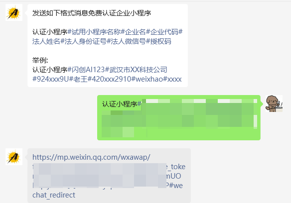
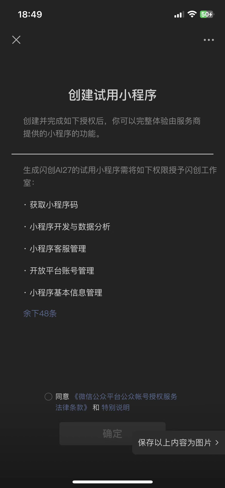
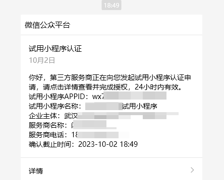
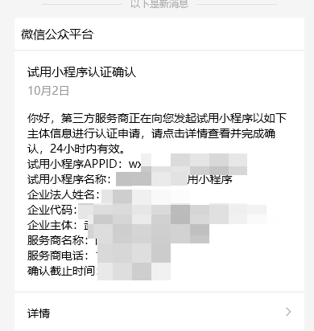
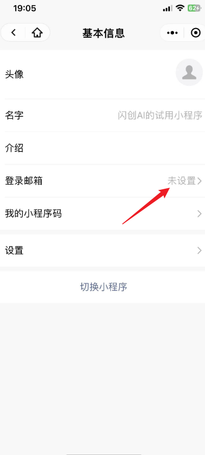

对于很多企业来说，微信小程序无疑是最好的轻应用和成交工具，但在实际运营过程中，很多企业发现，一个营业执照虽然可以注册50个小程序，但是法人的账户只能绑定5个，超出绑定就无法再次绑定，需要找到员工或者身边的朋友绑定为管理员，这样就很麻烦，每次有重要的扫码环节，都要找到朋友或者员工来进行扫码，且不安全因素很多，如员工离职，或朋友的微信号有问题之类的，导致小程序登录不上去！

还有个体营业执照的朋友，个体规定只能注册5个小程序，法人绑定5个，那么今天通过这套流程来操作认证小程序，可以突破法人只能绑定5个小程序的限制，且个体营业执照也能和公司营业执照一样，注册50个小程序，一个微信号就可以管理50个小程序了！以后操作就非常的方便！那么怎么实现小程序管理员能突破5个的限制和个体也能注册50个小程序呢，在这里我们交给大家方法。

## 扫描下方二维码

没错这个美女图片就是一个二维码

## 关注公众号

> 这里要特别注意：
>
> 使用本工具前微信名下已是5个以上小程序的管理员，请换个微信再来。

按照要求提交发送对应格式的信息后，将会收到一个链接

点击链接，并同意

等待3秒左右，会收到一个通知，点击后按照要求进行操作

然后又会收到一个认证确认，点击后确认

最后去`小程序助手`小程序里面绑定邮箱，就可以登录了

