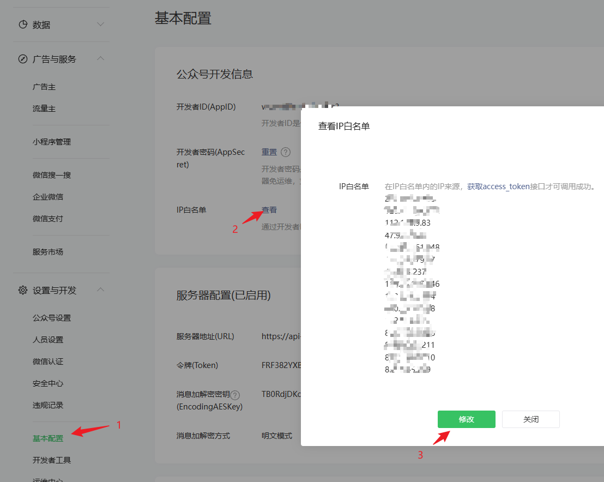

## 官方文档

[获取AccessToken](https://developers.weixin.qq.com/doc/offiaccount/Basic_Information/Get_access_token.html)

## Laf代码

创建函数，函数名为 `wx-utils`

```js
import cloud from '@lafjs/cloud'
const APP_ID = process.env.APP_ID
const APP_SECRET = process.env.APP_SECRET
const ACCESS_TOKEN_KEY = "access_token"

export async function getCachedAccessToken() {
  let accessToken = await cloud.shared.get(ACCESS_TOKEN_KEY)
  //判断本地缓存中是否存有 AccessToken
  if (!accessToken) {
    let access_token = await getAccessToken(APP_ID, APP_SECRET);
    await cloud.shared.set(ACCESS_TOKEN_KEY, access_token)
    return access_token.access_token
  } else {
    let {
      expires_in,
      access_token
    } = accessToken;
    const nowTime = new Date().getTime()
    if (nowTime >= expires_in) {
      // 已过期，并重新获取
      let access_token = await getAccessToken(APP_ID, APP_SECRET);
      await cloud.shared.set(ACCESS_TOKEN_KEY, access_token)
      return access_token.access_token
    } else {
      //查询的数据有效，直接返回数据
      return access_token
    }
  }
}

async function delCacheAccessToken() {
  await cloud.shared.delete(ACCESS_TOKEN_KEY)
}

async function getAccessToken(appid: string, secret: string) {
  const res = await cloud.fetch({
    url: `https://api.weixin.qq.com/cgi-bin/token?grant_type=client_credential&appid=${appid}&secret=${secret}`,
    method: 'GET'
  })
  //{"access_token":"68_vyJw32Dglo9Xa_18uUS_02JWy6UknsSqm84tx5kYEBSLl8nzp7Mtj-jWZmeEyyI3YTOVtGzgJcDs33MprjrRbX-5LJ5w_wZ2emNDf0PsODmCmjfnMT9oT-lpO9cMRAfAIAWBK","expires_in":7200}
  console.info("getAccessToken", res.data)
  if (res.data.errcode) {
    return null
  }
  res.data.expires_in = 7000000 + new Date().getTime()
  return res.data
}

```

## 代码解释

1. `const APP_ID = process.env.APP_ID`

    process.env是取的Laf的环境变量，具体说明点击查看：[环境变量设置](/docs/laf/env-set)

    APP_ID和APP_SECRET取的是小程序里面的值，具体说明点击查看：[获取AppId和AppSecret](/docs/wechat-offical-accounts/appid)

2. `cloud.shared`
   
   使用的是Laf全局缓存，具体请看：[Laf全局缓存](https://doc.laf.run/guide/function/function-sdk.html#%E4%BA%91%E5%87%BD%E6%95%B0%E5%85%A8%E5%B1%80%E7%BC%93%E5%AD%98)


## 常见错误

### 问题就是不在白名单
```json
{
  errcode: 40164,
  errmsg: 'invalid ip 121.41.21.175 ipv6 ::ffff:121.41.21.175, not in whitelist rid: 64f5e5b6-60e6c880-44619401'
}
```
解决方式：

