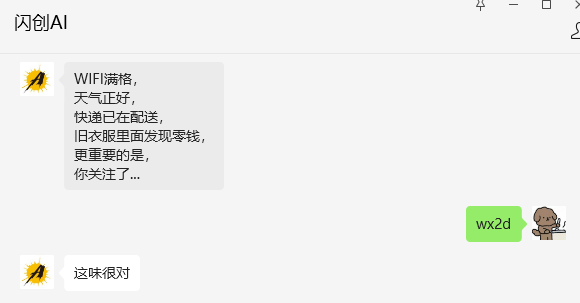
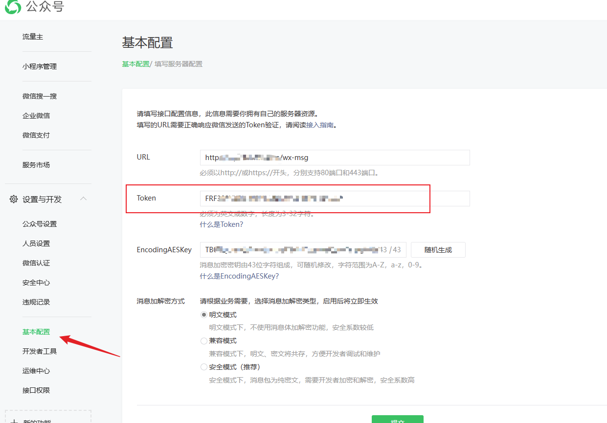
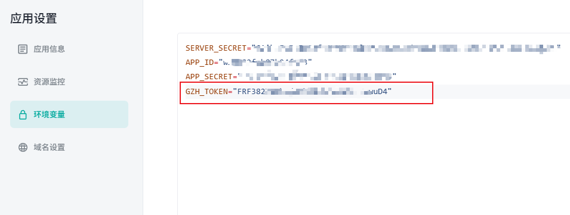
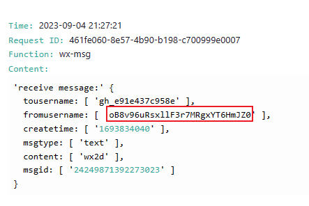

## 微信官方文档地址

[被动回复用户消息](https://developers.weixin.qq.com/doc/offiaccount/Message_Management/Passive_user_reply_message.html)


## 注意事项

这里消息必须要在5秒内做出相应，客服消息的时限会长一些，[发送客服消息](/docs/wechat-offical-accounts/send-custom-msg)

## LAF对应代码

创建函数，函数名为 `wx-msg`

```js

// 引入 crypto 和 cloud 模块
import * as crypto from 'crypto';

// 处理接收到的微信公众号消息
export async function main(ctx: FunctionContext) {
  const { signature, timestamp, nonce, echostr } = ctx.query;
  const token = process.env.GZH_TOKEN;
  // 验证消息是否合法，若不合法则返回错误信息
  if (!verifySignature(signature, timestamp, nonce, token)) {
    return 'Invalid signature';
  }

  // 如果是首次验证，则返回 echostr 给微信服务器
  if (echostr) {
    return echostr;
  }

  // 处理接收到的消息
  const payload = ctx.body.xml;
  console.log("receive message:", payload)
  // 接受文本消息
  if (payload.msgtype[0] === 'text') {
    return handleText(payload);
  }
  //接受事件消息
  if (payload.msgtype[0] === 'event') {
    //订阅发送
    if (payload.event[0] === 'subscribe') {
      return toXML(payload, `WIFI满格，\n天气正好，\n快递已在配送，\n旧衣服里面发现零钱，\n更重要的是，\n你关注了...`);
    }
  }
  // 其他情况直接回复 'success' 或者 '' 避免出现超时问题
  return 'success'
}

async function handleText(payload) {
  const userMsg = payload.content[0].trim()
  if (userMsg === 'wx2d') {
    return toXML(payload, "这味很对");
  }
  return 'success'
}

// 校验微信服务器发送的消息是否合法
function verifySignature(signature: string, timestamp: string, nonce: string, token: string) {
  const arr = [token, timestamp, nonce].sort();
  const str = arr.join('');
  const sha1 = crypto.createHash('sha1');
  sha1.update(str);
  return sha1.digest('hex') === signature;
}

// 返回组装 xml
function toXML(payload, content) {
  const timestamp = Date.now();
  const { tousername: fromUserName, fromusername: toUserName } = payload;
  return `
  <xml>
    <ToUserName><![CDATA[${toUserName}]]></ToUserName>
    <FromUserName><![CDATA[${fromUserName}]]></FromUserName>
    <CreateTime>${timestamp}</CreateTime>
    <MsgType><![CDATA[text]]></MsgType>
    <Content><![CDATA[${content}]]></Content>
  </xml>
  `
}

```

## 效果演示




## 代码解释

1、`GZH_TOKEN` 环境变量公众号token的获取，具体设置变量的方法参考[环境变量设置](/docs/laf/env-set)





2、根据日志可以找到发送者的openid，此处代码也可以结合[客服发送消息](/docs/wechat-offical-accounts/send-custom-msg)使用




