# 注册服务号并认证

这里公众号分为两种，`订阅号`和`服务号`，他们两个有什么区别？[官方解释](https://kf.qq.com/faq/120911VrYVrA130805byM32u.html)

`订阅号`：主要偏于为用户传达资讯（类似报纸杂志），认证前后都是每天只可以群发一条消息；

`服务号`：主要偏于服务交互（类似银行，114，提供服务查询），认证前后都是每个月可群发4条消息

1. 如果想简单的发送消息，达到宣传效果，建议可选择订阅号；
2. 如果想用公众号获得更多的功能，例如开通微信支付，建议可以选择服务号；
3. 如果想用来管理内部企业员工、团队，对内使用，可申请企业微信；
4. 订阅号不支持变更为服务号，同样，服务号也不可变更成订阅号。

毫无疑问，我们肯定选企业微信认证的服务号，可以有更多的操作空间，更重要的是可以用微信支付收钱，订阅号个人的就完全足够了。

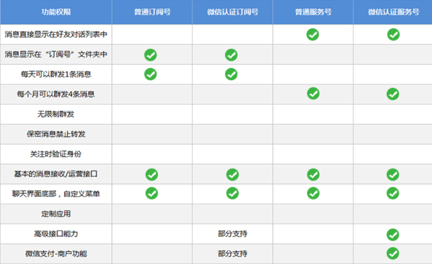

## 注册微信认证的服务号

### 1. 打开微信公众号官网
   
[微信公众号官网](https://mp.weixin.qq.com)

### 2. 点击立即注册
   
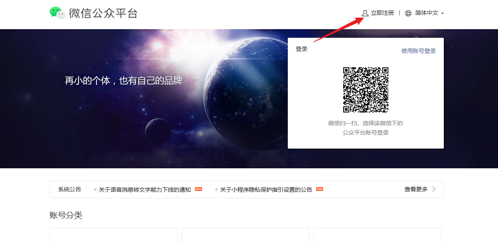

### 3. 点击服务号 
   
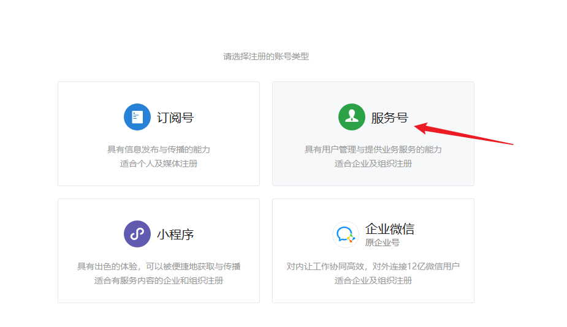

### 4. 激活邮箱，打开邮箱，收到一封邮件`激活你的微信公众平台账号 `
   
   

### 5. 选择服务号，这里可以看到，个人整不了。
   
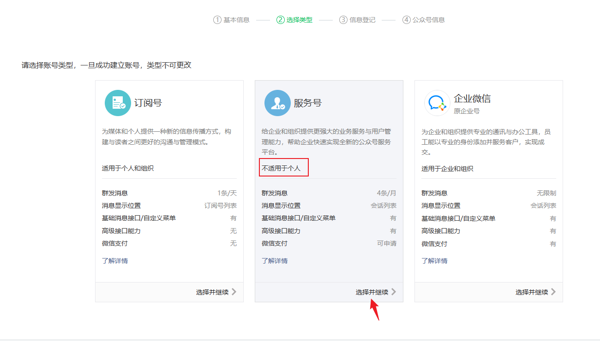   

### 6. 填写相应的信息，我是个体工商户，所以选择了个体户
   
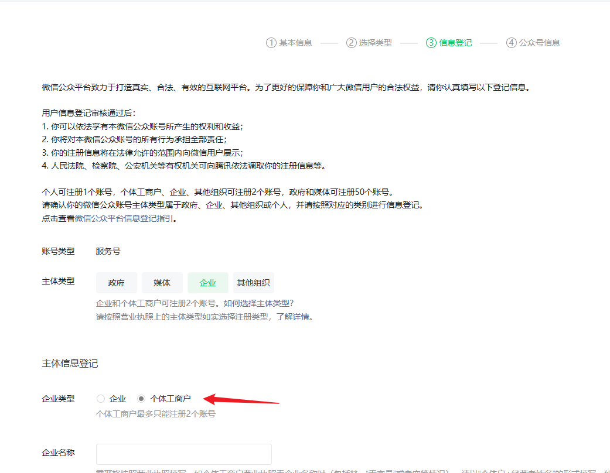     

### 7. 这里好像改了，验证方式可以选择`法定代表人验证`，之前我是用的`微信认证`，需要交300块，血亏啊！！
   
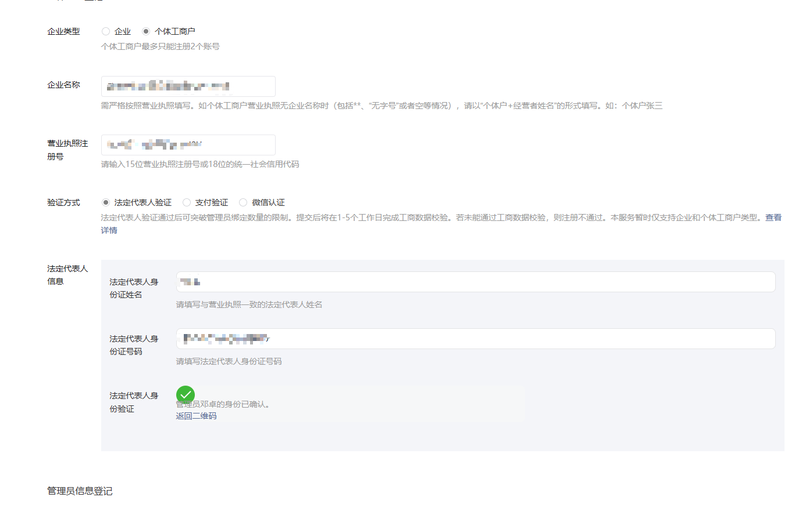       

### 8. 填写公众号信息
   
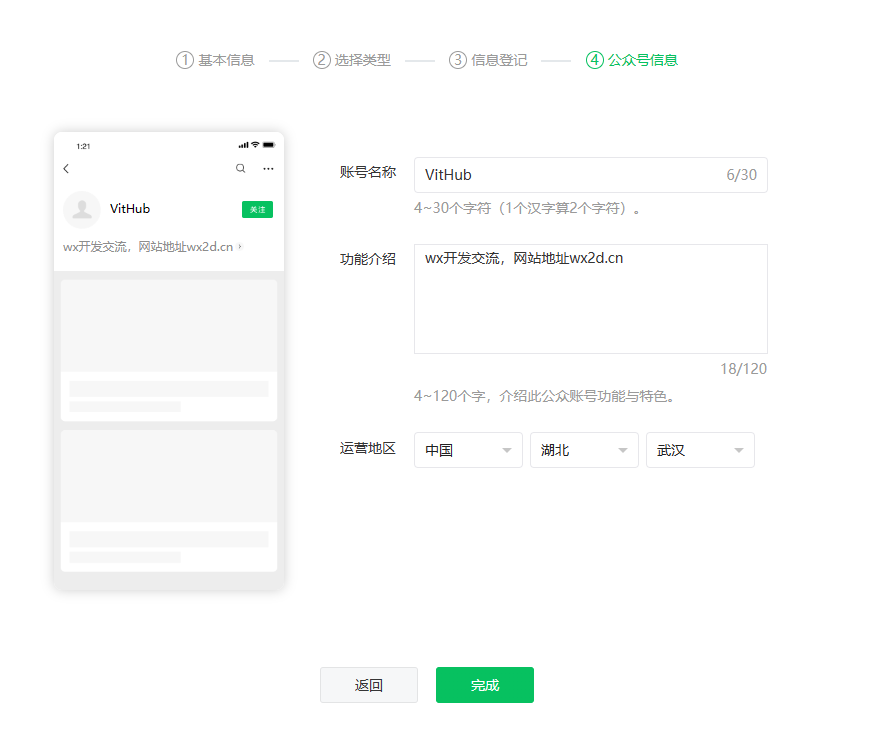          

### 9. 注册成功

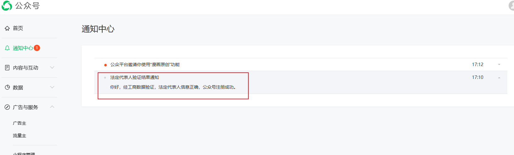     

### 10. 微信认证，这里需要缴纳300块，没错每年都要缴纳。

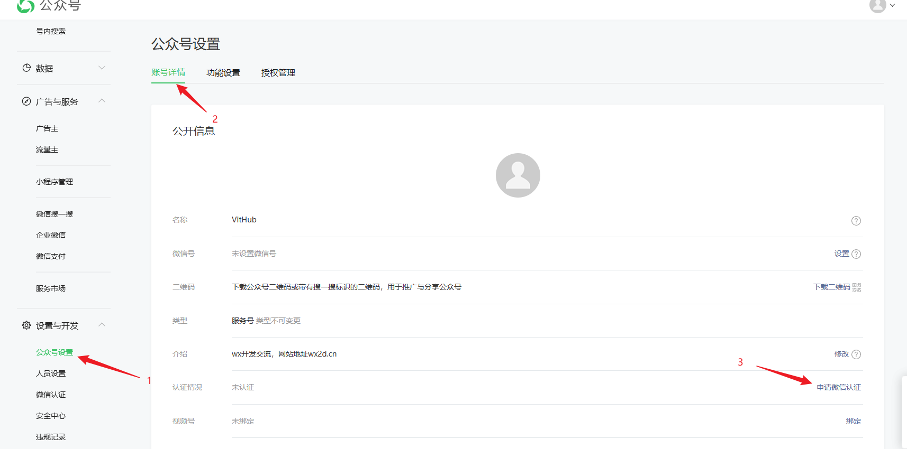   

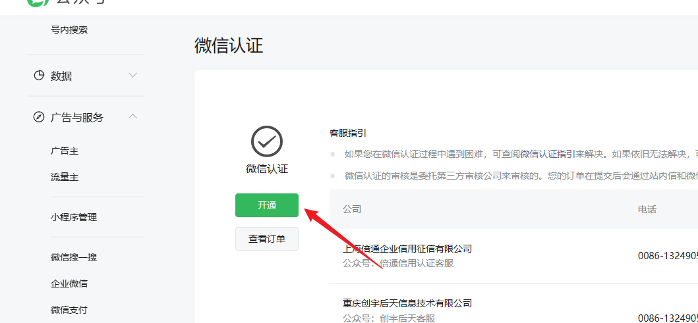  

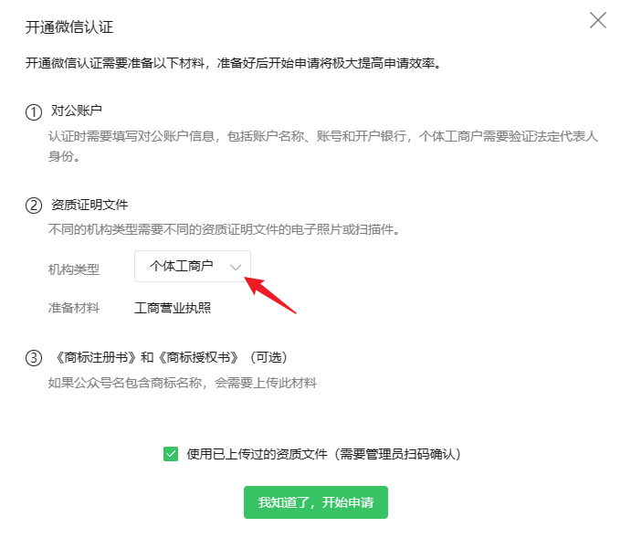     
   
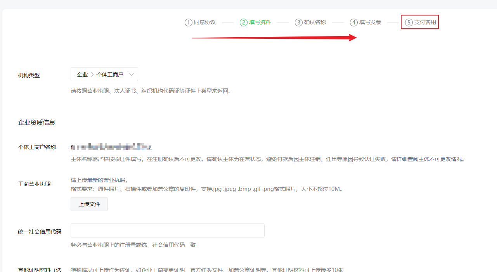     

### 11. 这里我就不演示全部了，因为我已经认证了一个服务号了，当支付完费用后，过几天就会有电话打来，这个时候你确认一下，就认证成功了。

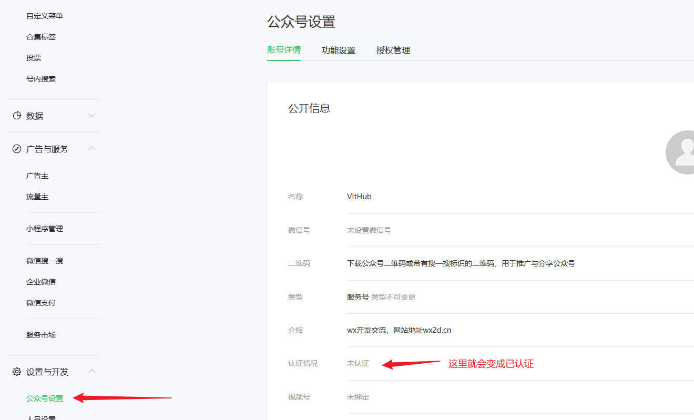   
