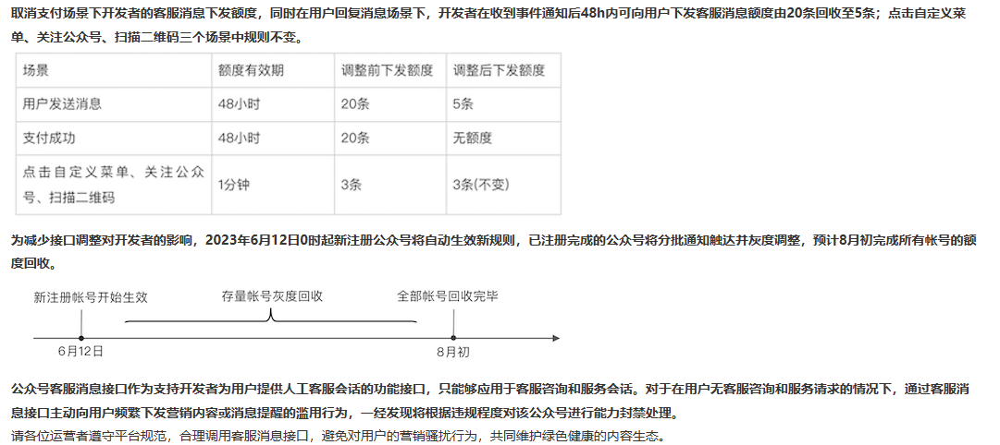
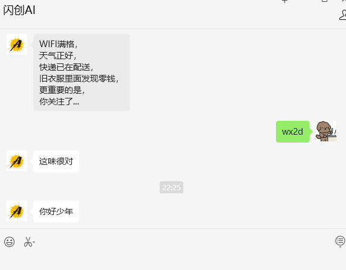

## 微信官方文档地址

[客服发送消息](https://developers.weixin.qq.com/doc/offiaccount/Message_Management/Service_Center_messages.html#%E5%AE%A2%E6%9C%8D%E6%8E%A5%E5%8F%A3-%E5%8F%91%E6%B6%88%E6%81%AF)


## 注意事项

为了防骚扰，微信做出如下调整([官网通告](https://mp.weixin.qq.com/cgi-bin/announce?action=getannouncement&announce_id=116853659399Heuo&version=&lang=zh_CN&token=))：




## LAF对应代码

创建函数，函数名为 `wx-utils`

```js

export async function sendCustomMsg(openId: string, msg: string) {
  console.log("openId", openId, "msg", msg)
  const accessToken = await getCachedAccessToken()
  const postRes = await cloud.fetch.post("https://api.weixin.qq.com/cgi-bin/message/custom/send?access_token=" + accessToken, {
    "touser": openId,
    "msgtype": "text",
    "text":
    {
      "content": msg
    }
  });
  console.log("sendCustomMsg", postRes.data)
  return "success"
}

```

创建一个函数测试，名为`custom-msg`
```js
import cloud from '@lafjs/cloud'
import { sendCustomMsg } from '@/wx-utils'


export default async function (ctx: FunctionContext) {
  await sendCustomMsg('oB8v96uRsxllF3r7MRgxYT6HmJZ0','你好少年')
  return { data: 'hi, laf' }
}

```

## 效果演示



## 代码解释

  1、`openId` 获取流程参考[获取用户id](https://developers.weixin.qq.com/doc/offiaccount/User_Management/Getting_a_User_List.html)，或者查看[被动回复用户消息](/docs/wechat-offical-accounts/basic-msg)

  2、`getCachedAccessToken` 此方法获取AccessToken的方法，具体代码查看 [获取AccessToken](/docs/wechat-offical-accounts/access-token)

  3、Laf应用使用自定义域名[自定义应用域名](/docs/laf/bind-domain)


