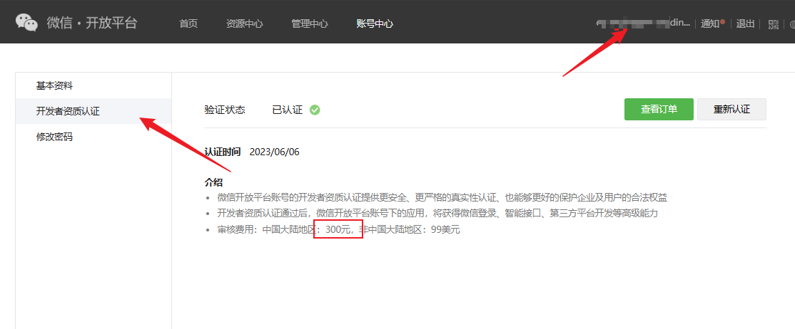
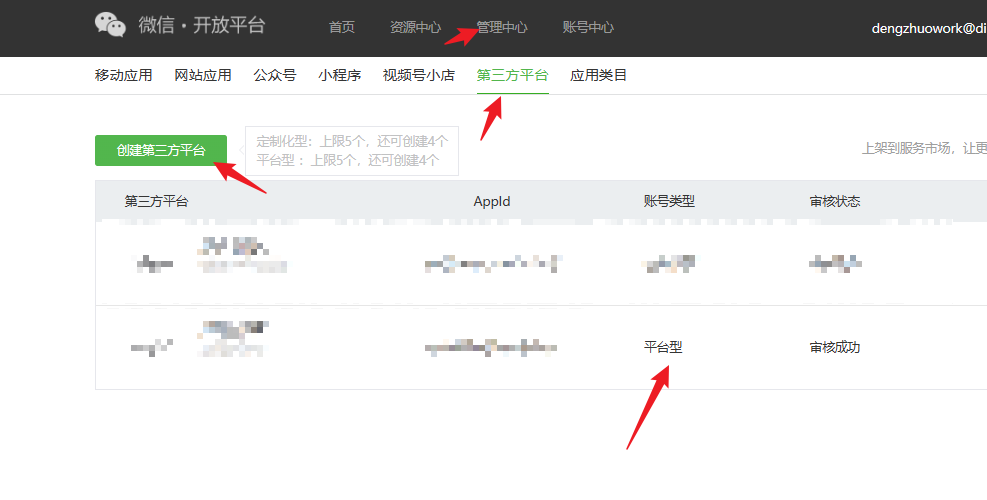
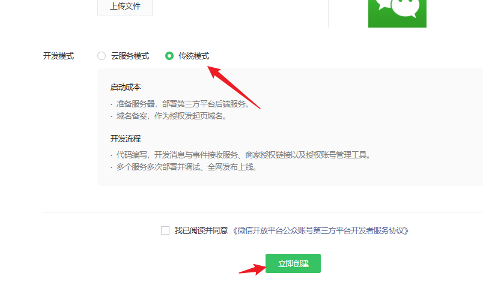
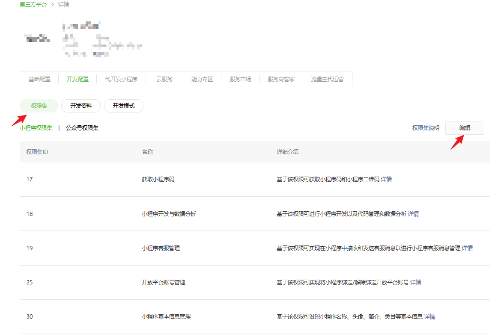
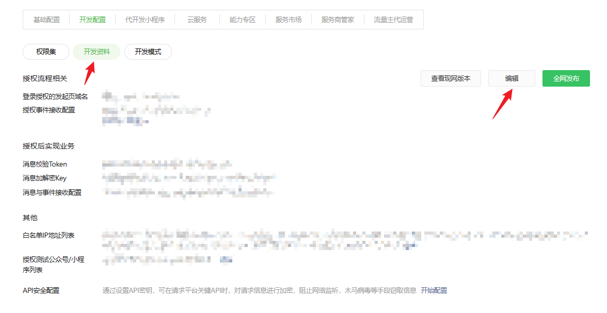

## 登录微信开放平台

[登录地址](https://open.weixin.qq.com/)

## 开发者资质认证

首先我们得认证资质，可以看到需要缴纳300块钱




## 创建第三方平台

创建一个第三方平台 ，重点这里的账号类型要是`平台型`，安装下面提交后等待审核






## 开发配置

 这里审核完成之后就需要开发配置，点击详情进入配置项目

1. 权限集点击编辑，全勾上
   


2. 开发配置，这里是重点，直接影响成不成功



这里使用laf作为服务地址，[laf注册地址](http://laf.run/signup?code=RHkdt6z)

1. 创建函数方法`message`

```js
// 引入 crypto 和 cloud 模块
import * as crypto from 'crypto';
import cloud from '@lafjs/cloud';
import { WXMsgCrypto } from '@/wx-utils'
const db = cloud.database()

// 处理接收到的微信公众号消息
export async function main(ctx: FunctionContext) {
  console.log('request', ctx)
  const { signature, timestamp, nonce, echostr } = ctx.query;
  console.log("query", signature, timestamp, nonce, echostr)
  const payload = ctx.body.xml;
  console.log("receive message:", payload)
  const { appid, encrypt } = payload
  let token
  console.log("appid[0]", appid[0])
  const config = await db.collection('config').where({ appid: appid[0] }).getOne();
  console.log("config", config.data)
  if (config.data) {
    token = config.data.token
  } else {
    return 'appid unauthorized';
  }
  // 验证消息是否合法，若不合法则返回错误信息
  if (!verifySignature(signature, timestamp, nonce, token)) {
    console.log('Invalid signature')
    return 'Invalid signature';
  }
  // 如果是首次验证，则返回 echostr 给微信服务器
  if (echostr) {
    return echostr;
  }
  // 处理接收到的消息
  const wxCrypt = new WXMsgCrypto(config.data.token, config.data.aesKey, config.data.appid)
  const decryptMsg = wxCrypt.decrypt(encrypt[0])
  console.log("decryptMsg", decryptMsg)
  var parseString = require('xml2js').parseString;
  parseString(decryptMsg.message, { trim: true }, (err, result) => {
    if (err) {
      console.log("err", err)
    } else {
      console.info(result);
      if (result.xml.InfoType[0] === 'component_verify_ticket') {
        const cacheTicket = "CACHE_COMPONENT_VERIFY_TICKET_" + result.xml.AppId[0]
        cloud.shared.set(cacheTicket, result.xml.ComponentVerifyTicket[0])
        console.log("缓存成功", cacheTicket, result.xml.ComponentVerifyTicket[0])
      }
    }
  })
  // 其他情况直接回复 'success' 或者 '' 避免出现超时问题
  return 'success'
}

// 校验微信服务器发送的消息是否合法
function verifySignature(signature, timestamp, nonce, token) {
  const arr = [token, timestamp, nonce].sort();
  const str = arr.join('');
  const sha1 = crypto.createHash('sha1');
  sha1.update(str);
  return sha1.digest('hex') === signature;
}

// 返回组装 xml
function toXML(payload, content) {
  const timestamp = Date.now();
  const { tousername: fromUserName, fromusername: toUserName } = payload;
  return `
  <xml>
    <ToUserName><![CDATA[${toUserName}]]></ToUserName>
    <FromUserName><![CDATA[${fromUserName}]]></FromUserName>
    <CreateTime>${timestamp}</CreateTime>
    <MsgType><![CDATA[text]]></MsgType>
    <Content><![CDATA[${content}]]></Content>
  </xml>
  `
}

```