# 申请微信支付

前提是你得有企业资质，然后有一个企业认证的小程序或者公众号（[注册服务号教程](/docs/wechat-offical-accounts/register)）。如果想接入微信支付，一个低成本的方法就是去注册一个个体工商户。如果嫌麻烦，个人小程序也可以靠广告产生收入。

## 喂饭级教程

### 1. 打开微信支付官网
   
[微信支付官网](https://pay.weixin.qq.com)

### 2. 点击成为商家 
   
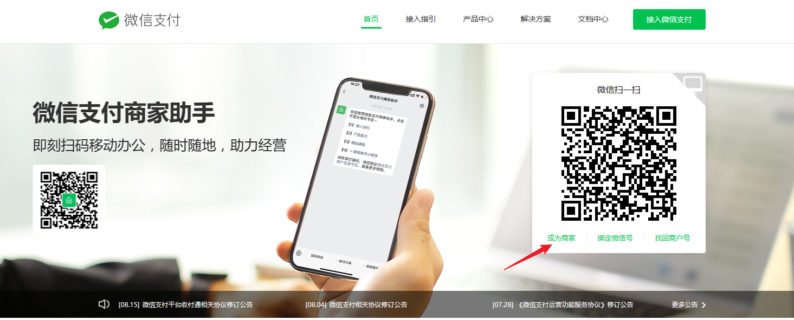

### 3. 注册微信支付商户号 
   
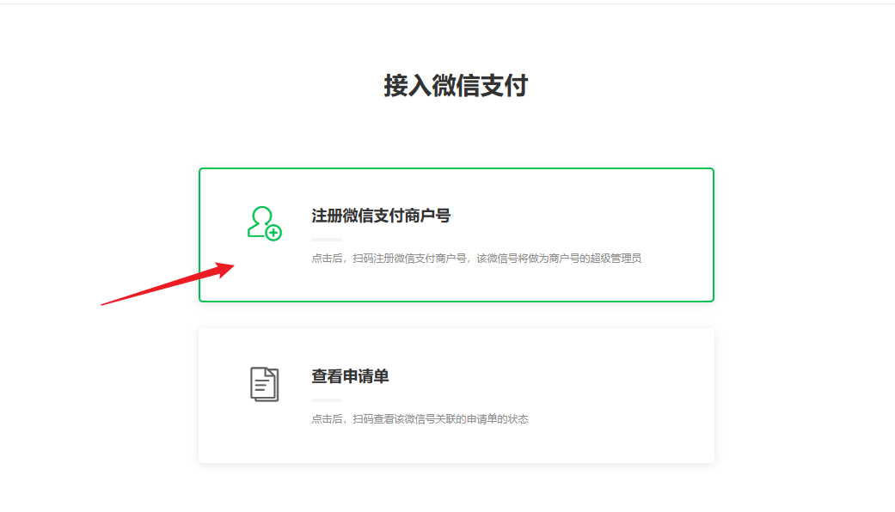

### 4. 微信扫码，扫码微信会成为超级管理员
   
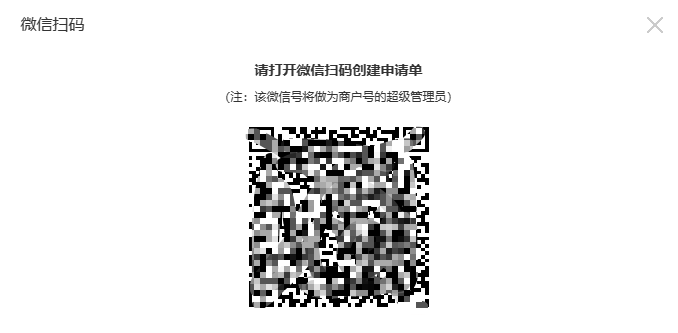

### 5. 完成信息填写 
   
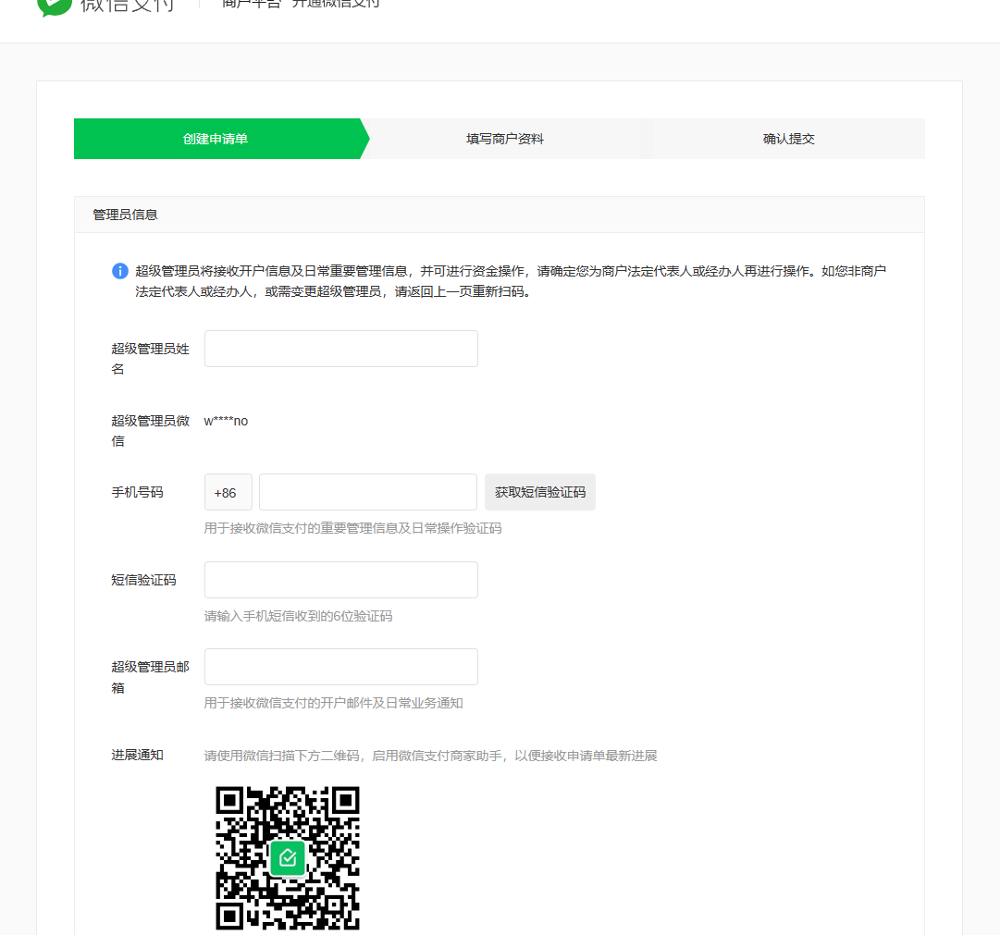

### 6. 所属行业填写，由于我企业认证了一个公众号，所以经营场景这里选了公众号，具体根据自身的实际情况填写，经营场景勾一个就可以了，后续都是可以在商户里面开通其他的

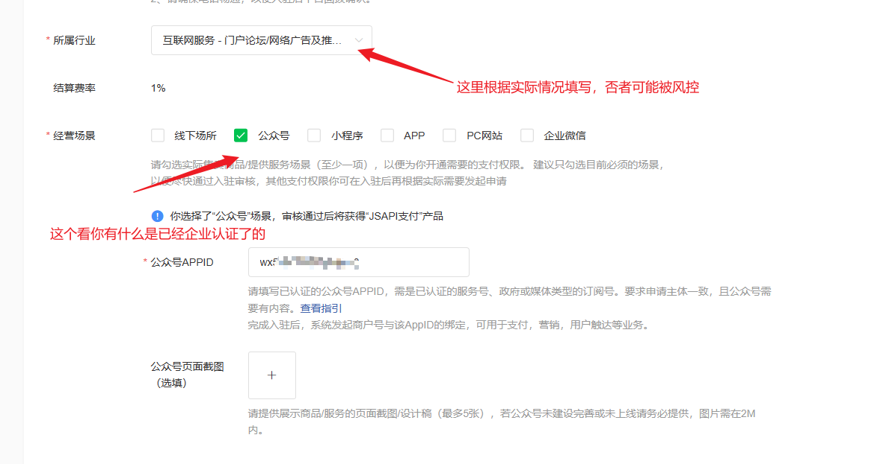

### 7. 微信会收到一个入驻申请进展通知，申请状态为`审核中`，网页也会进入一个账户验证环节，选择方式一。微信扫码就可以了
    
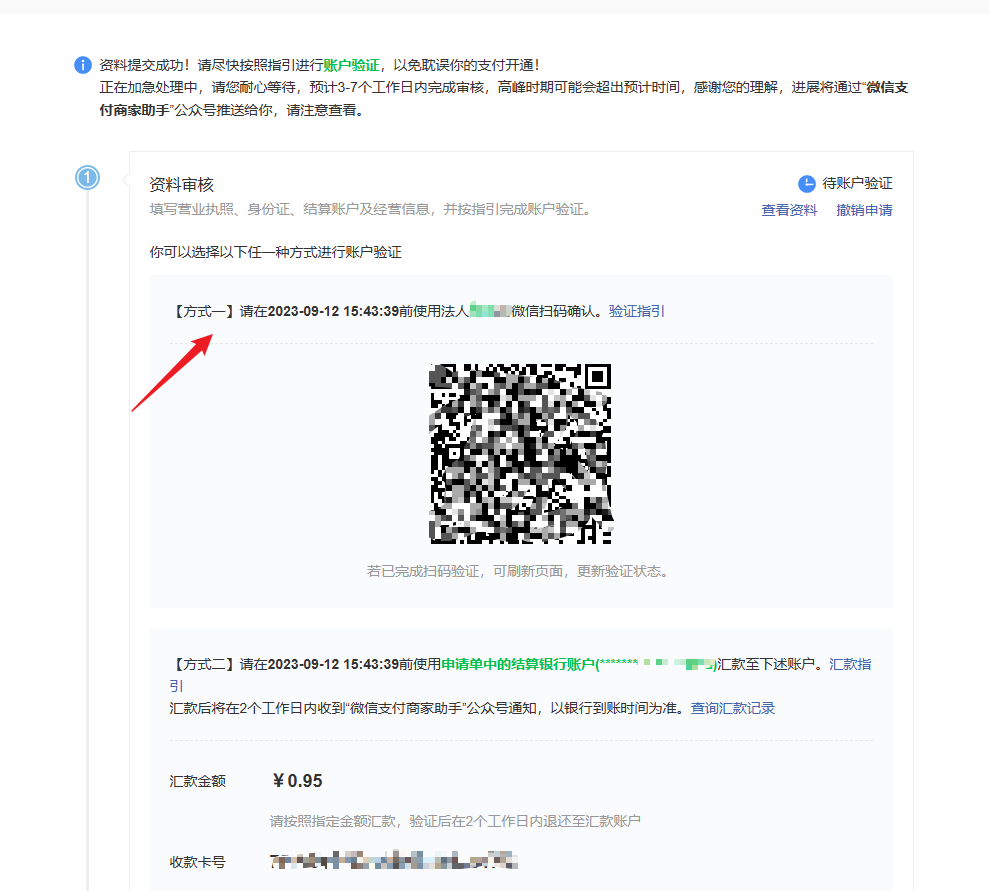

### 8. 微信会收到一个驻申请进展通知,申请状态为`待签约`，点击进去，选择`自动提现，系统按交易账单提现`，点击`确认开户并签署协议`
    
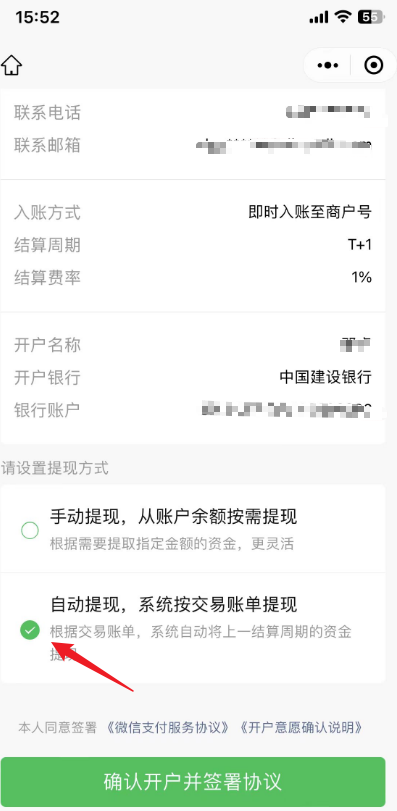

### 9.  微信会收到一个微信支付身份核验

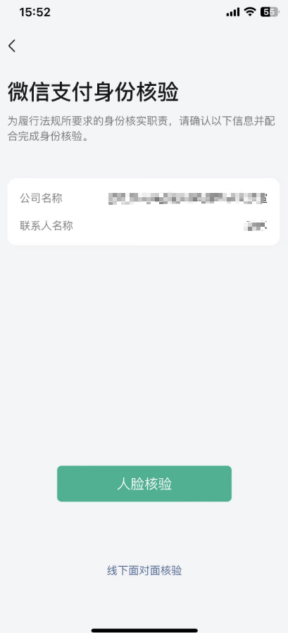

### 10.  微信会收到一个成功通知，故事还没有结束。

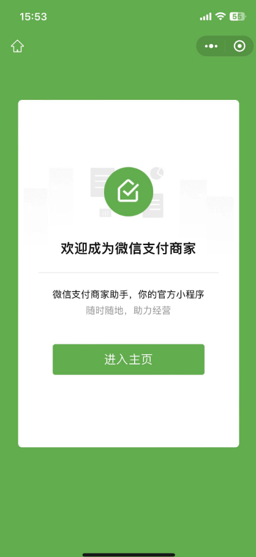

### 11. 最后最重要的一步，微信会收到一个商户绑定公众号授权的通知，一定要去公众号里面授权一下

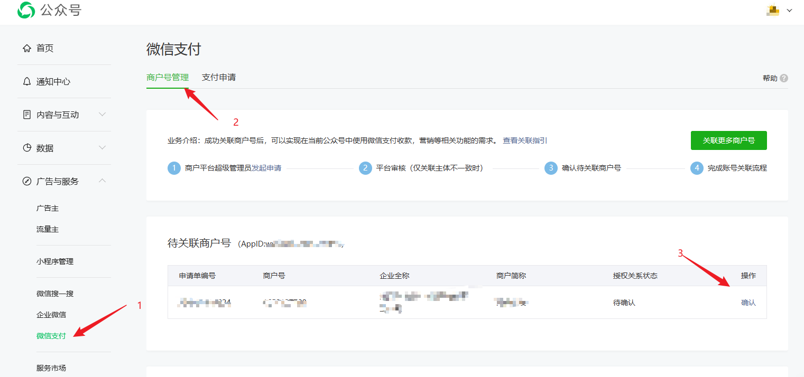

### 12. 恭喜恭喜，可以愉快的接入微信支付了

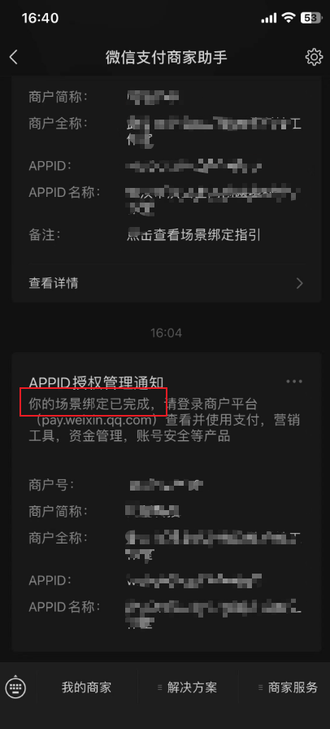
